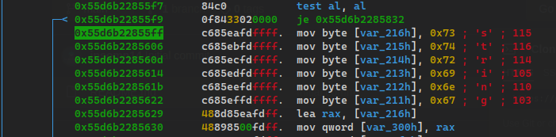
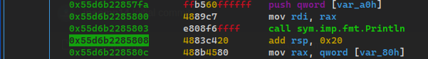
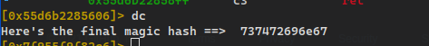

## Solution

Unpack the binary with upx

```
upx -d goofysys -o rev
```

Open with radare2 and start debugging mode

```
$ r2 -A -d ./rev 
```

Set a couple breakpoint at `main` & `sym.main.main`. then continue until hit breakpoints.

```
[0x7f9561363100]> db main
[0x7f9561363100]> db sym.main.main
[0x7f9561363100]> dc
hit breakpoint at: 55d6b2285150
[0x55d6b2285150]> dc
hit breakpoint at: 55d6b2285a52
```

After a few minuts doing analysis there is a few call function `sym.main.encode` -> `sym.main.ezdecode`.
Same as before our goal to print the flag.

Use command `pdf` to show function `sym.main.ezdecode` and then modif register `rip` with address after `je`.
Next step is set breakpoint after `sym.imp.fmt.Println`, and then continue




```
[0x55d6b2285b48]> dr rip=0x55d6b22855ff
0x55d6b2285b48 ->0x55d6b22855ff
[0x55d6b2285b48]> ds
[0x55d6b2285606]> dc
Here's the final magic hash ==>  737472696e67
```




FLAG : `flag{737472696e67}`
