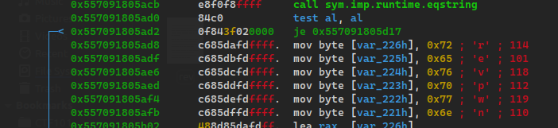
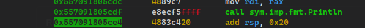
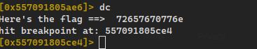

## Solution

Unpack the binary with upx

```
upx -d goofysys -o rev
```

Open with radare2 and start debugging mode

```
$ r2 -A -d ./rev 
```

Set a couple breakpoint at `main` & `sym.main.main`. then continue until hit breakpoints.

```
[0x7f4b2fcec100]> db main
[0x7f4b2fcec100]> db sym.main.main
[0x7f7cbc8b5081]> dc
hit breakpoint at: 557091805e3f
[0x7f7cbe2ae100]> dc
hit breakpoint at: 557091805630
```

use command `pdf` to show function `sym.main.notmain` and then modif register `rip` with address after `je`.
Next step is set breakpoint after `sym.imp.fmt.Println`, and then continue



```
[0x557091805fa9]> dr rip=0x557091805ad8
0x557091805fa9 ->0x557091805ad8
[0x557091805ae6]> db 0x557091805ce4
[0x557091805fa9]> ds
child stopped with signal 28
[+] SIGNAL 28 errno=0 addr=0x00000000 code=128 ret=0
[0x557091805adf]> dc
Here's the flag ==>  72657670776e
hit breakpoint at: 557091805ce4
```




FLAG : `flag{72657670776e}`
